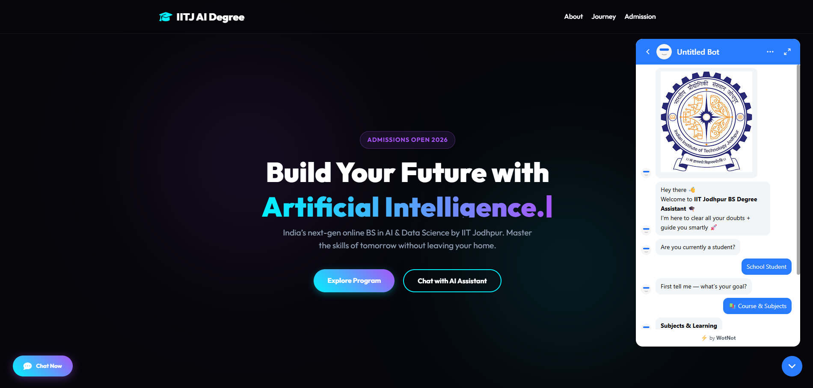

# 🤖 IITJ AI Assistant Bot

> 🚀 Interactive AI-powered chatbot + modern website for **IIT Jodhpur BS in Applied AI & Data Science** – built using WotNot & advanced web technologies.

---

## 🌐 Live Demo

👉 [Click to Explore the Website](https://iitj-ai-assistant-bot.vercel.app/)

---

## 📌 Overview

IITJ AI Assistant Bot is a modern, visually stunning **AI-powered chatbot + informational website** designed to guide students about the **BS in Applied AI & Data Science program at IIT Jodhpur**.

It combines a **premium UI/UX design** with an **interactive chatbot assistant** to deliver a seamless and engaging user experience.

> 🎯 Designed to simplify program understanding and provide instant guidance through AI interaction.

---

## ✨ Features

* 🤖 AI Chatbot Integration (WotNot)
* 🎯 Interactive Student Guidance System
* 🌐 Fully Functional Informational Website
* 🎨 Modern Glassmorphism + Neon UI Design
* ⚡ Smooth Animations & Scroll Effects
* 🧠 Typewriter Effect in Hero Section
* 📊 Interactive Quiz Section
* 🧭 Structured Learning Path Timeline
* 📱 Fully Responsive Design

---

## 🧠 Key Functionalities

### 🤖 AI Chat Assistant

* Helps users understand the program
* Provides instant responses to queries
* Enhances user engagement

### 🎓 Program Information Sections

* About IIT Jodhpur Program
* Features & Curriculum
* Career Opportunities
* Admission Process

### 🧩 Interactive Elements

* Typewriter animation
* Scroll reveal effects
* Quiz-based eligibility checker

---

## 💡 User Flow

1. User lands on homepage 🌐
2. Explores program details 📘
3. Interacts with AI chatbot 🤖
4. Takes eligibility quiz 🧩
5. Proceeds to admission guidance 🎯

---

## 🛠️ Tech Stack

* **Frontend:** HTML5, CSS3, JavaScript
* **UI Design:** Glassmorphism + Neon Effects
* **Animations:** CSS + JavaScript
* **Chatbot:** WotNot
* **Icons:** Font Awesome
* **Fonts:** Google Fonts (Outfit)
* **Deployment:** Vercel

---

## 📂 Project Structure

```
📁 IITJ-AI-ASSISTANT-BOT
│── index.html
│── README.md
│── screenshot.png
```

---

## 🚀 Getting Started

### 1️⃣ Clone the Repository

```bash
git clone https://github.com/dk-khandelwal06/IITJ-AI-ASSISTANT-BOT.git
```

### 2️⃣ Open the Project

Simply open:

```bash
index.html
```

✅ No installation required
✅ No dependencies

---

## 📸 Screenshots



---

## 🔮 Future Enhancements

* 🤖 Advanced AI (Custom NLP Model)
* 📊 Analytics Dashboard
* 🌐 Backend Integration
* 🎥 Video-based Guidance
* 🔐 User Login System

---

## 🤝 Acknowledgements

💡 Built as part of experimentation with AI tools and chatbot integration using WotNot.

---

## 📬 Connect with Me

**Daksh Khandelwal**  
1st Year BS in AI & Data Science @ IIT Jodhpur  
📧 dk.khandelwaliitj@gmail.com  
🔗 [LinkedIn Profile](https://www.linkedin.com/in/daksh-khandelwal-b02748391/)

## 🔥 Final Note

> Built with passion to make AI education more accessible, interactive, and engaging 🚀
